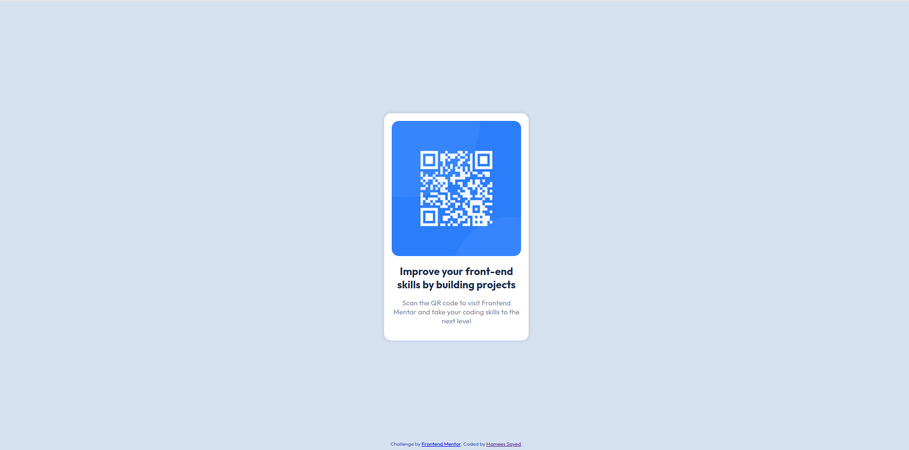

# Frontend Mentor - Product preview card component solution

This is a solution to the [Product preview card component challenge on Frontend Mentor](https://www.frontendmentor.io/challenges/product-preview-card-component-GO7UmttRfa). Frontend Mentor challenges help you improve your coding skills by building realistic projects. 

## Table of contents

  - [Screenshot](#screenshot)
  - [Links](#links)
  - [Built with](#built-with)
  - [Continued development](#continued-development)
  - [Useful resources](#useful-resources)
  - [Author](#author)

### Screenshot

### Links

- Solution URL: [Solution](https://github.com/hamees-sayed/qr-code)
- Live Site URL: [Live site URL](https://qr-code-component-hamees.netlify.app/)

### Built with

- HTML5
- CSS3

### Continued development

I'll probably next work to make this site responsive

### Useful resources

- [W3 Schools](https://www.w3schools.com) 

## Author

- Frontend Mentor - [@hamees-sayed](https://www.frontendmentor.io/profile/hamees-sayed)
- Twitter - [@HameesSayed2](https://www.twitter.com/HameesSayed2)
